layout:true

Introduction to Open Data by <a xmlns:cc="http://creativecommons.org/ns#" href="http://www.datapolitan.com" property="cc:attributionName" rel="cc:attributionURL">Richard Dunks, Noelle Francois</a> is licensed under a <a rel="license" href="http://creativecommons.org/licenses/by-nc-sa/4.0/">Creative Commons Attribution-NonCommercial-ShareAlike 4.0 International License</a>.

---

class: center

- - -
# Introduction to Open Data
## Richard Dunks
## Noelle Francois

## Follow along at: https://data-guest-lectures.github.io/intro-open-data-heatseek/

---

# Introductions
+ Name
+ Program/Major at John Jay
+ Which organization you interned with (if applicable)
+ One thing you'd like to get out of the workshop today

---

# Goals for today
--

+ Provide some background on open data
--

+ Discuss the main elements of open data
--

+ Show some meaningful uses of open data
--

+ Practice working with open data

---

class:center,middle
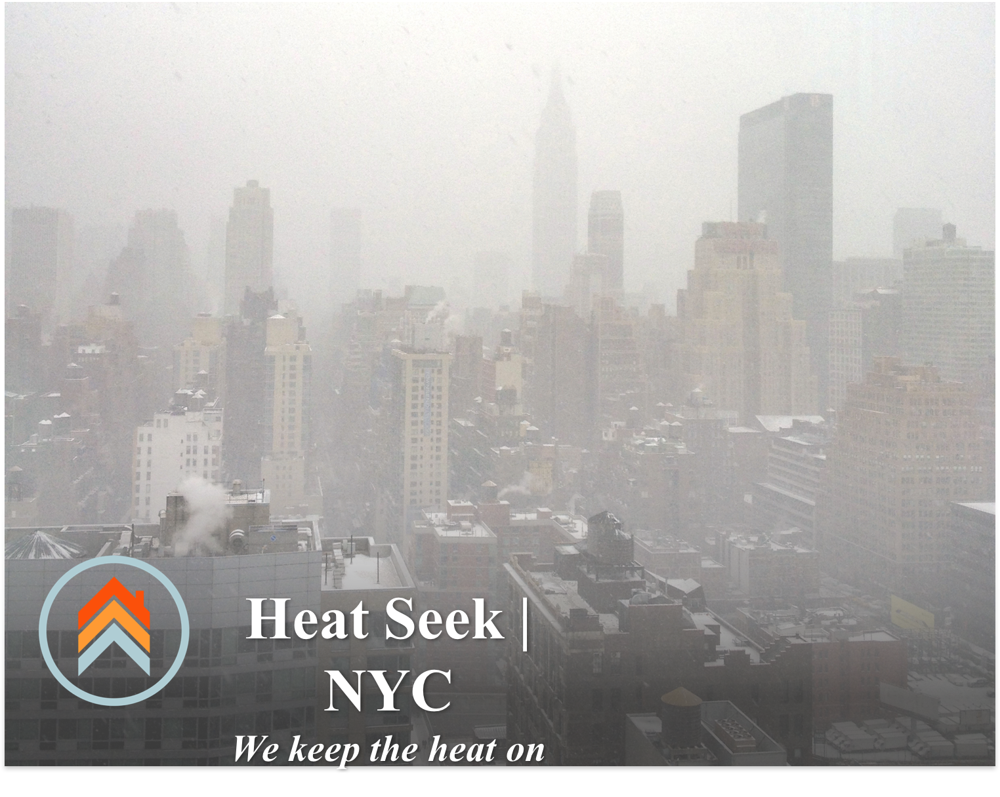

---

class:center,middle

---

class:center,middle
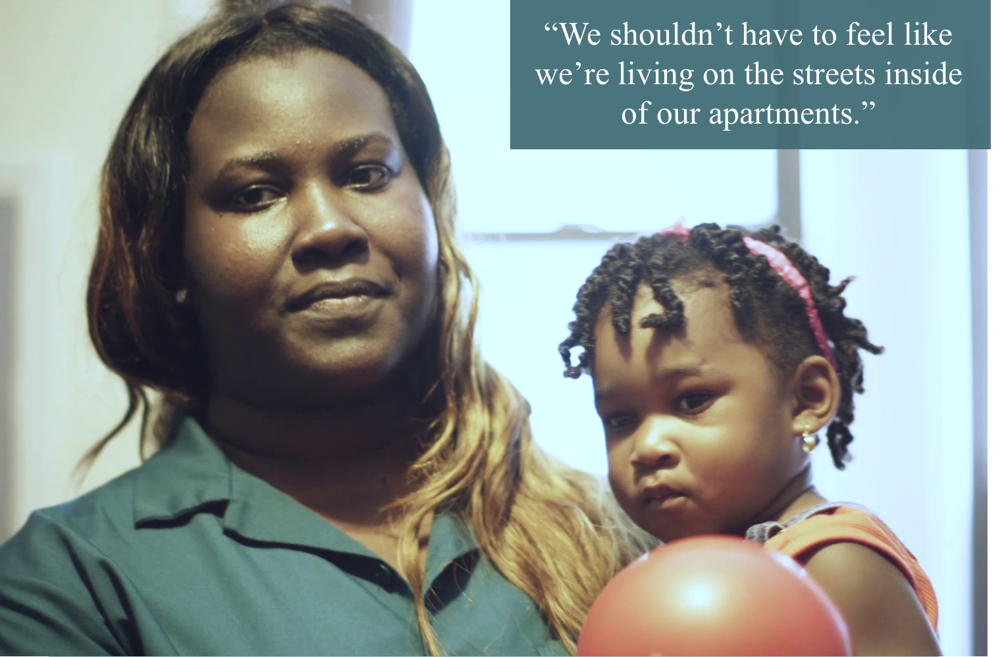

---

class:center,middle
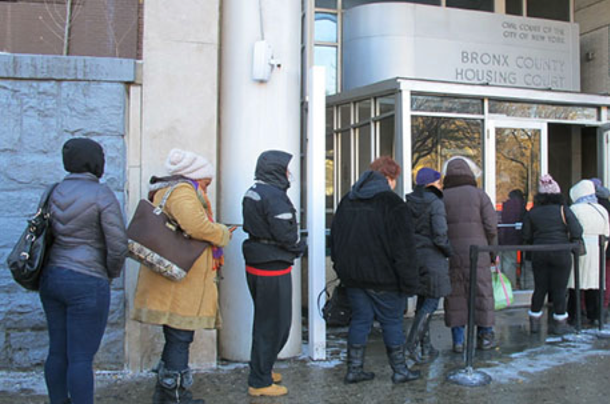

---

class:center,middle

---

class:center,middle
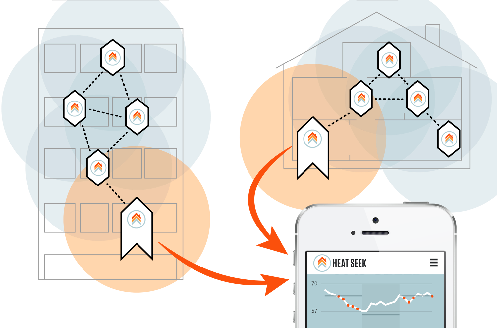

---

class:center,middle
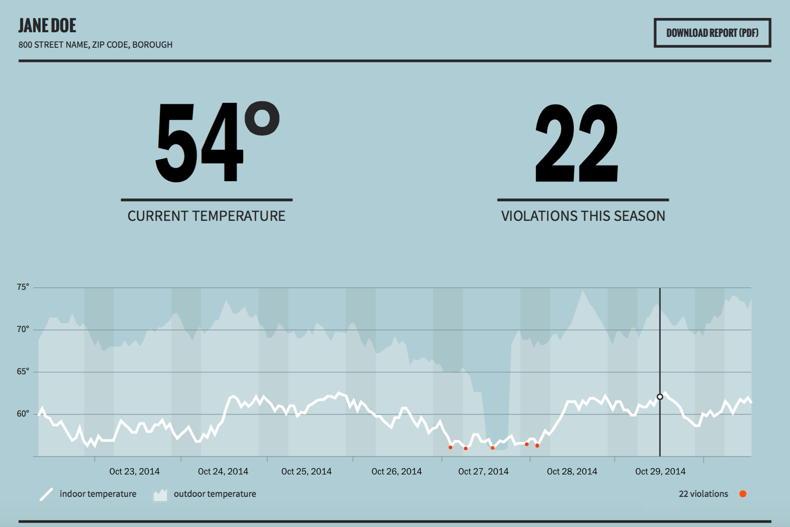

---

class:center,middle
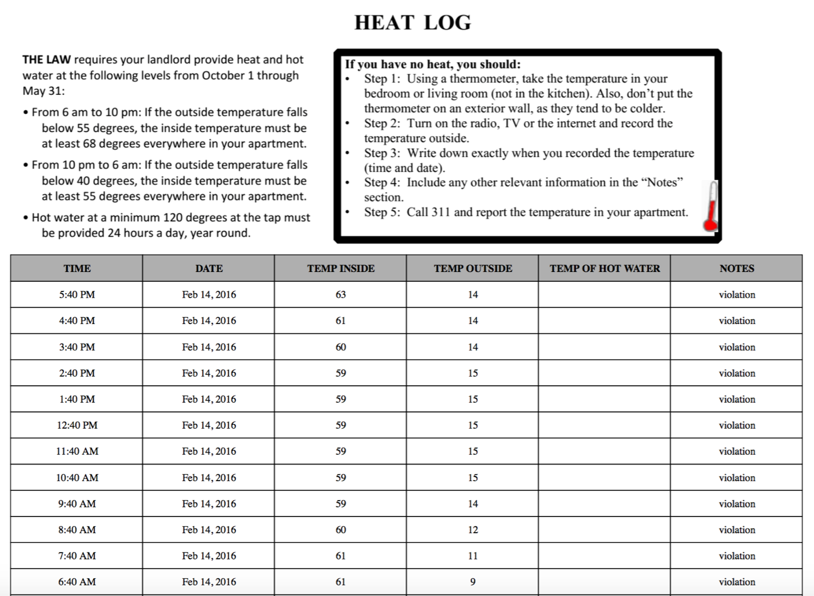

---

# Why do we collect data?
--

+ Data describes phenomena of interest
--

+ Can describe the phenomena directly or indirectly

--

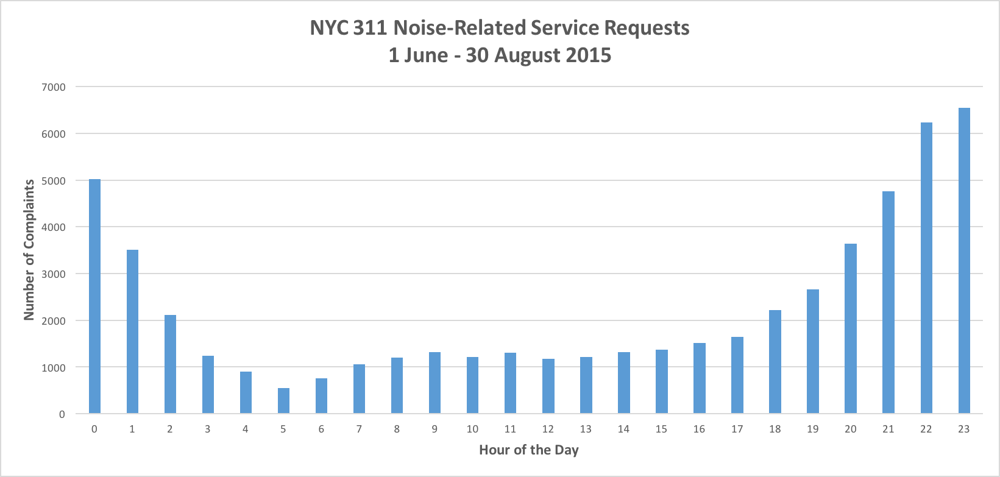

---

# Why do we collect data?
+ Data describes phenomena of interest
+ Can describe the phenomena directly or indirectly
+ Can't manage what you can't measure

---

class:center,middle
# What is open data?

---

class: middle, center
> Open data is data that can be freely used, shared and built-on by anyone, anywhere, for any purpose

## [Open Knowledge Foundation](http://blog.okfn.org/2013/10/03/defining-open-data/)

---

# Key Features of Open Data
--

+ Availability and access
--

+ Reuse and redistribution
--

+ Universal participation

---

# Benefits of Open Data
--

+ Transparency
--

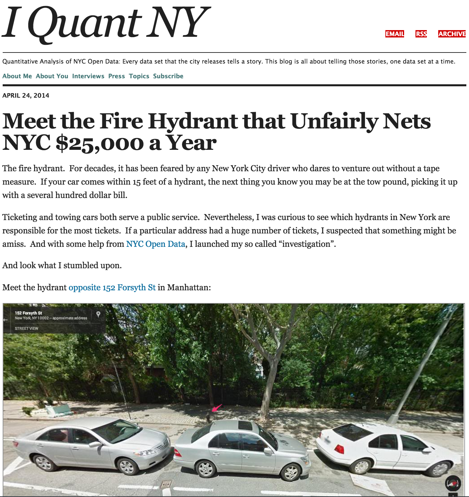

---

# Benefits of Open Data
+ Transparency
+ Releasing social and commercial value

--

---

# Benefits of Open Data
+ Transparency
+ Releasing social and commercial value

---

# Benefits of Open Data
+ Transparency
+ Releasing social and commercial value

---

# Benefits of Open Data
+ Transparency
+ Releasing social and commercial value

---

# Benefits of Open Data
+ Transparency
+ Releasing social and commercial value
+ Participation and engagement
--

---
class:center,middle
# Concerns with Open Data

---

# Reliability
--

+ Veracity of source
--

+ Currency of data

---

# Privacy
--

+ Personally identifiable information (PII)
--

https://www.wired.com/2013/07/mugshot-removal-extortion/

---

# Privacy
+ Personally identifiable information (PII)

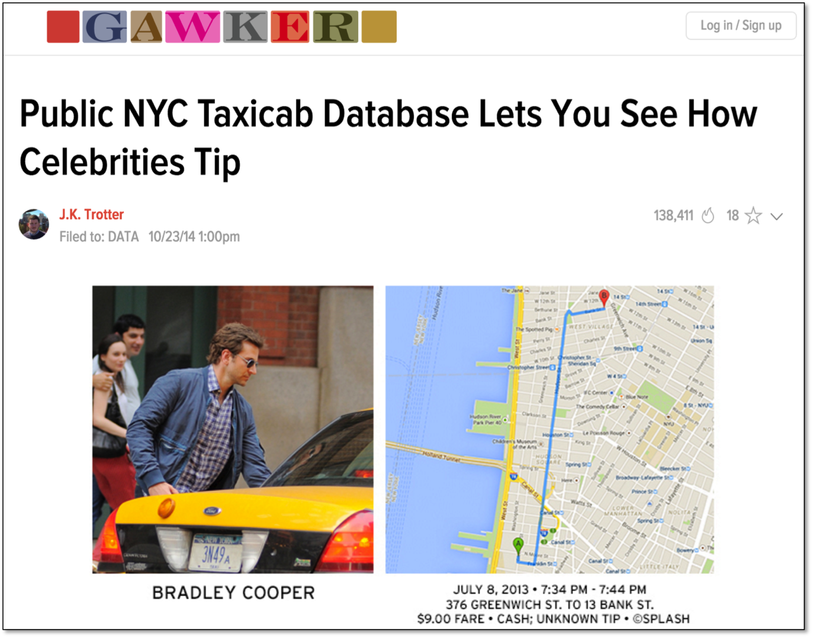
http://gawker.com/the-public-nyc-taxicab-database-that-accidentally-track-1646724546 

---

# Privacy
+ Personally identifiable information (PII)

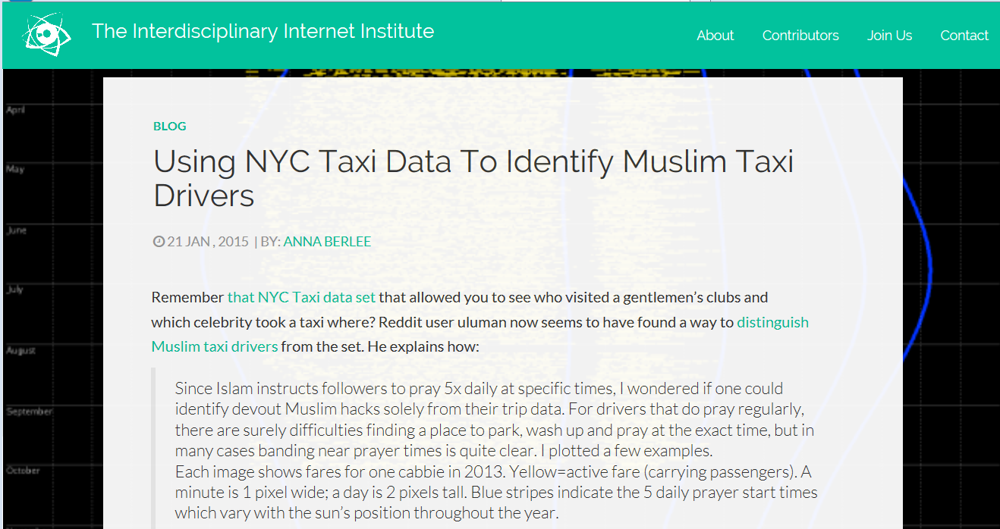

http://www.theiii.org/index.php/997/using-nyc-taxi-data-to-identify-muslim-taxi-drivers/ 

---

# Privacy
+ Personally identifiable information (PII)
+ Mosaic Effect

---

# Confidentiality
--

+ Proprietary information
--

+ Trade secrets
--

+ Government procurement information

---

# Security
--

+ Identify sensitive infrastructure
--

http://openseweratlas.tumblr.com/map

---

# Security
+ Identify sensitive infrastructure
+ Describe methods and procedures

---

class:center,middle
# Quick History of Open Data in NYC

---

# Timeline of Open Data in NYC
--

+ June 4, 1974 - Federal FOIA signed into law
--

+ September 1, 1974 - First New York Freedom of Information Law (FOIL)
--

+ April 1, 1993 - First Edition NYC Public Data Directory (first municiple data directory in the country)
--

+ January 31, 2002 - Mayor Bloomberg announced 311 program to replace over 40 help-lines, including 14 for public safety, 8 for infrastructure, regulatory and community services, 7 for business affairs and waste management, and 11 for health and human services

---

# Timeline of Open Data in NYC
--

+ October 6, 2009 - Launch of NYC Open DataMine Website, the precursor to current the NYC Open Data Portal
--

+ March 7, 2012 - Local Law 11 of 2012 signed by Mayor Bloomberg
--

[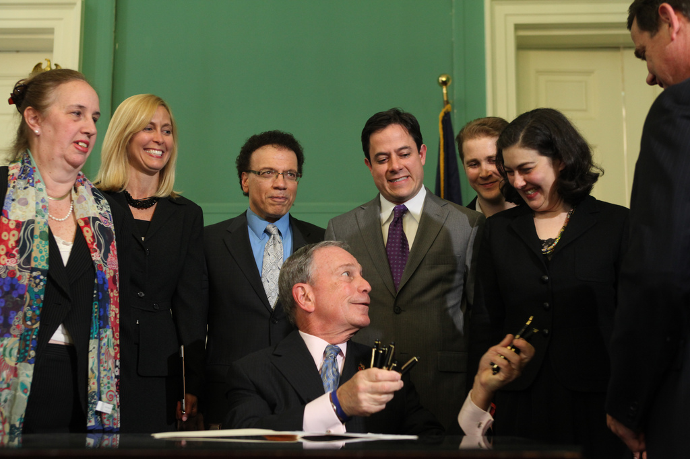](https://data.cityofnewyork.us/new-homepage)

---

# Local Law 11 of 2012

> ### The council hereby finds and declares that it is in the best interest of New York city that its agencies and departments make their data available online using open standards. Making city data available online using open standards will make the operation of city government more transparent, effective and accountable to the public. It will streamline intra-governmental and inter-governmental communication and interoperability, permit the public to assist in identifying efficient solutions for government, promote innovative strategies for social progress, and create economic opportunities.

---

# Open Data Portals
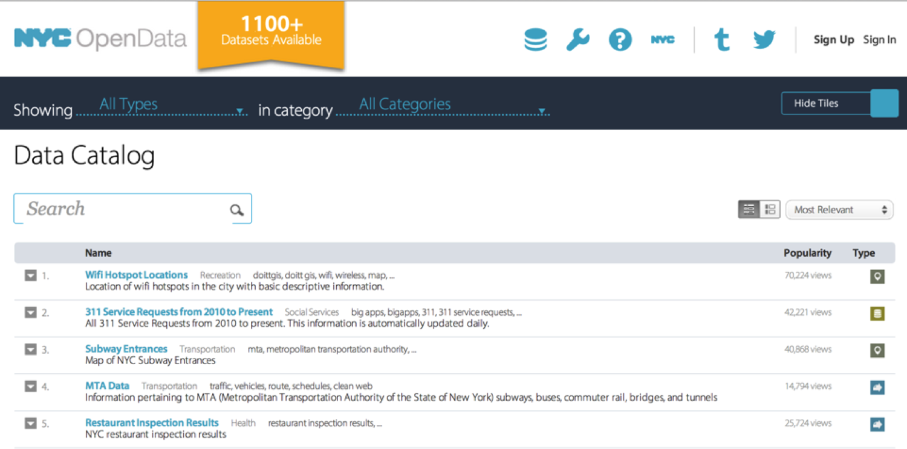

---

# Exploratory Data Analysis
--

+ Goal -> Discover patterns in the data
--

+ Understand the context
--

+ Summarize fields
--

+ Use graphical representations of the data
--

+ Explore outliers

--

### Tukey, J.W. (1977). Exploratory data analysis. Reading, MA: Addison-Wesley.

---

# So Let's Work with Some Open Data

--

---

class:center,middle
# https://data.cityofnewyork.us/

---

class:center,middle
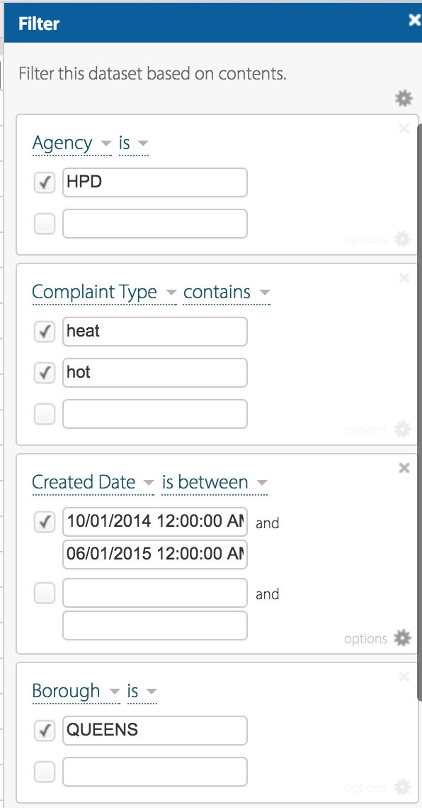

---

# Why are we filtering for Queens?
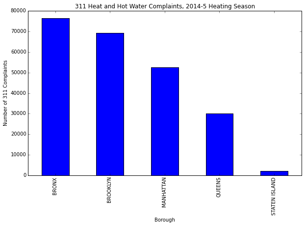

---

class:center,middle
# Now let's look at another dataset
### https://data.cityofnewyork.us/Housing-Development/Housing-Maintenance-Code-Violations/wvxf-dwi5
---

class:center,middle
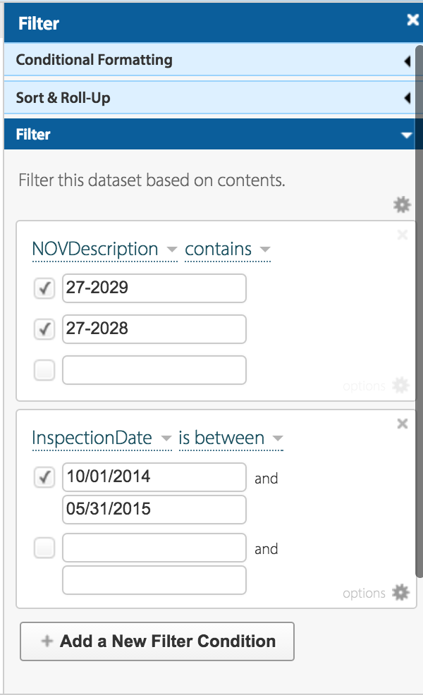

---

# How would we know to filter by these?

--

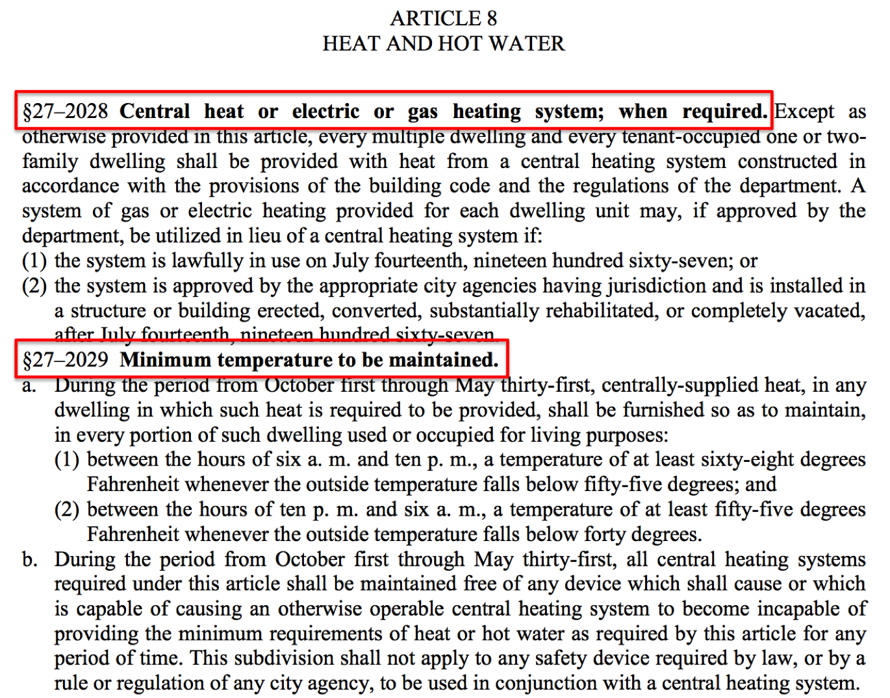
##### http://www1.nyc.gov/assets/buildings/pdf/HousingMaintenanceCode.pdf

---

class:center,middle
# You all knew that, right?

---

# Notice also the heating season
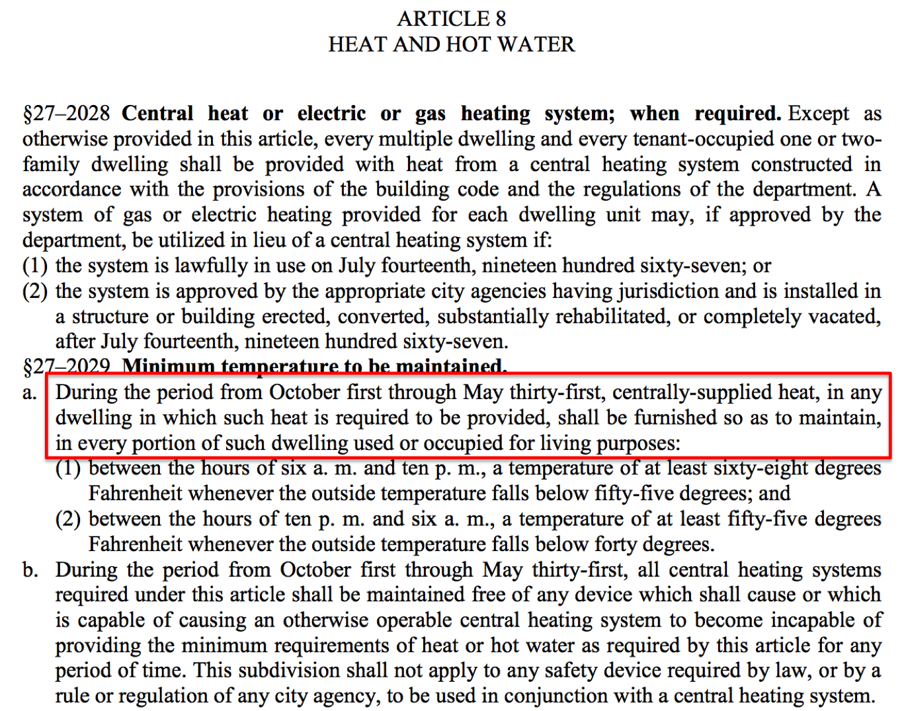

---

# What are the problems with the violations data?
--

+ Very few complaints result in violation
--

+ Can't track complaints to violations
--
 _(at least not easily)_
--

+ Not clear from data when housing law is in effect
--
 _(on warmer days, housing law isn't in effect)_
--

+ No locations (latitude, longitude)

---

# But when you put it all together...
<iframe width="100%" height="485" frameborder="0" src="https://richard-datapolitan.cartodb.com/viz/d4f860c6-1c6b-11e6-b01a-0e31c9be1b51/embed_map" allowfullscreen webkitallowfullscreen mozallowfullscreen oallowfullscreen msallowfullscreen></iframe>
---

# Wrap-up
--

+ Value of open data
--

+ Concerns with open data
--

+ The history of open data in NYC
--

+ Explored an example of open data in NYC

---

# Final Thoughts
--

+ Access to open data allows organizations to identify problems in their communities and advocate for positive changes
--

+ Not all open data is created equal and some datasets can take more time and effort to understand than others

---

## History of Open Data
+ Tauberer, Joshua, Open Government Data: The Book ["Ancient Origins of Open Access to Laws"](https://opengovdata.io/2014/ancient-origins-open-access-to-law/)
+ Chignard, Simon, "[A brief history of open data](http://www.paristechreview.com/2013/03/29/brief-history-open-data/)" ParisTech Review
## History of NYC Open Data
+ http://www.opengovtimeline.com/

---

class:middle,center
# Thank You

---

## Richard Dunks

+ [richard@datapolitan.com](mailto:richard@datapolitan.com)
+ http://blog.datapolitan.com
+ [@rdunks1](https://twitter.com/rdunks1)/[@datapolitan](https://twitter.com/Datapolitan)

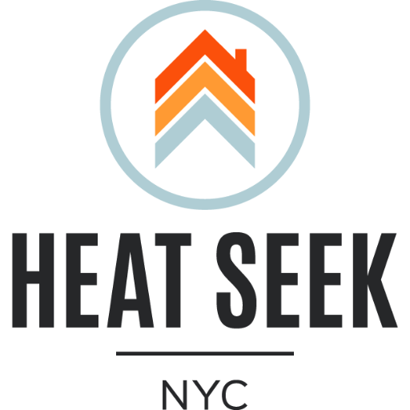
## Noelle Francois
+ [noelle@heatseek.org](mailto:noelle@heatseek.org)
+ http://heatseek.org
+ [@heatseeknyc](https://twitter/com/@heatseeknyc)
